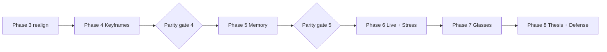

# Eykon — Master Roadmap (Phases 3 → 8)

> Created 05 October 2026. Sources: `new_Dev.md` (brainstorm), LightMem-Ego
> (Chen et al., arXiv:2607.11487, read in full), existing `docs/plans/`,
> `.memory/` logs and on-device KPI runs (Pixel 9 Pro XL, Infinix Note 12).
> Phase 1 and Phase 2 plans are untouched. Nothing previously documented has
> been deleted — older plans are annotated, not replaced.

---

## 1. What we are actually building (one paragraph)

A fully on-device system that continuously perceives the world through an
egocentric camera and microphone, decides **online** (no look-ahead) which
moments are worth remembering, turns them into structured, timestamped memory
in SQLite, organises that memory hierarchically (current → short-term →
long-term episodic/semantic), keeps object/entity state consistent when the
world changes, and answers present-tense and historical questions by voice or
text — with **zero network calls at runtime**. Laptop first as the lab, phone
as the real target, smart glasses as the final capture device.

## 2. The defendable research problems (what makes this an FYP, not plumbing)

| # | Problem | Why no library solves it | Phase |
|---|---|---|---|
| P1 | **Budget-constrained online keyframe / event segmentation** on egocentric streams | Must decide per frame in milliseconds, no look-ahead, while missing neither 0.5 s actions (keys put down) nor flooding on static scenes | 4 |
| P2 | **Hierarchical memory + temporal state reconciliation** | LightMem-Ego itself states its update mechanism "lacks a principled policy for revising, merging, forgetting, or promoting memories" — this is the gap we target | 5 |
| P3 | **Asymmetric scheduling under a phone thermal/RAM envelope** (perception vs. live Q&A on one SoC) | Shared memory bus + ~2.5–3 W passive limit; our Infinix run already hit 4.68 W avg and 58.9 °C SoC | 6 |
| P4 | **Split computing for glasses ↔ phone** under BLE/Wi-Fi bandwidth and glasses battery | Where to cut the pipeline (raw stream vs. gated keyframes vs. embeddings) is an open trade-off | 7 |

## 3. Positioning vs. LightMem-Ego (verified facts, not brainstorm numbers)

What LightMem-Ego actually reports (Sections 3–5 + Limitations of the paper):

- Architecture: thin phone/glasses client → **backend server**. The client only
  samples, compresses, timestamps and uploads frames + audio chunks.
- Memory: current (rolling buffer) → short-term (micro-events with
  representative frames, *provisional* caption, async transcript backfill) →
  long-term (episodic + semantic). A **query router** picks the cheapest
  sufficient memory level.
- Results: R@3 = 74.1, MRR = 0.627; QA accuracy 51.9 % (LLM-judged) / 55.6 %
  (human-judged); P50 end-to-end latency 5.86 s (phone, short-term) and
  14.87 s (phone, long-term).
- Limitations (their words, paraphrased): relies on **upstream API calls** for
  ASR, vision, generation and QA; no principled revise/merge/forget/promote
  policy; no privacy pipeline (no redaction, no retention policy).

Our delta: (1) everything on-device, (2) a principled state/lifecycle policy,
(3) a gated perception cascade instead of fixed low-rate upload, (4) privacy
controls in the loop. We **borrow** their hierarchy, provisional-caption +
async-refine idea and query router. We must cite them as the reference
design, not pretend they don't exist.

> [!WARNING]
> `new_Dev.md` quotes some numbers for LightMem-Ego (e.g. "77.8 % retrieval",
> "P90 8.61–13.60 s") that do **not** match what we read in the paper body,
> and cites several papers we could not locate ("Mem-Alpha", "TokenPilot",
> "EgoLife on Edge Devices"). Every citation must be verified before it goes
> into a panel document — see Phase 3 Step 16.

## 4. Laptop vs. mobile — recommendation

**Recommendation: "Laptop is the lab, phone is the exam, every phase ends with
an exam."** Not pure laptop-first, not fully parallel.

- Pure laptop-first (what Phase 3 did) produced exactly the risk you described:
  the 30-min soak test says "zero throttling" but it ran on a fan-cooled laptop
  at 13.3 s/frame; that says nothing about a phone in a pocket.
- Fully parallel (build every step twice) doubles the work and the Kotlin side
  lags anyway, so it is parallel only on paper.
- Middle path, enforced by structure:
  1. Each step is researched and implemented on the laptop under a **Mobile
     Emulation Profile** (below).
  2. Each phase has a **Mobile Parity Gate** as its last step: the same logic,
     same model files, same golden test inputs run on the Pixel 9 Pro XL
     (flagship) and Infinix Note 12 (low-end). The phase is not "done" until
     both phones produce results within the stated tolerance — or the gap is
     documented and explained.
  3. Anything that only exists on the phone (camera FGS, IMU, battery,
     thermals) gets a **phone spike early** in the phase, not at the end.

### 4.1 Mobile Emulation Profile (laptop rules)

| Rule | How it's enforced | Why |
|---|---|---|
| CPU only, no CUDA | `MEMORY_` setting forcing CPU; llama.cpp `n_gpu_layers=0` | Phones have no CUDA |
| 4 threads, pinned | `psutil.Process().cpu_affinity([...])` + `n_threads=4` | Phone big cores ≈ 2–4 usable |
| RAM ceiling | Watchdog samples RSS; run is **marked failed** above budget (3.5 GB flagship / 2.0 GB low-end profile) | OOM-killer on Android is not optional |
| Same artifacts | Identical `.litertlm` / `.gguf` / `.tflite` files and quantisation as the phone | Avoid "worked with FP16 on laptop" |
| Same input | Frames at the resolution + fps CameraX will actually deliver (e.g. 640×480 @ 2–4 fps) | Avoid "worked on 1080p, phone gives 480p" |
| **Wall-clock replay** | Videos replayed at real speed, not as-fast-as-possible; backlog and dropped frames are recorded | Offline batch hides real-time queueing failure |
| Same DB features | Same SQLite schema; FTS4 vs FTS5 parity decided explicitly (Android has no FTS5 by default — already hit in Phase 2) | Avoid silent search differences |
| Measured slowdown factor | Per component, laptop latency ÷ phone latency is **measured** at each parity gate | Never assume "2–5×" again |
| Golden fixtures | `data/golden/` frames/audio + expected outputs as JSON; Python tests and Kotlin unit tests read the same files | Proves both implementations agree |

## 5. Testing protocol — every step, three layers

1. **Automated** — unit/integration tests, benchmark scripts, JSON results.
2. **You-in-the-loop (mandatory)** — every step doc has a section
   `## You test this` with concrete instructions ("open the webcam page, put
   your keys on the desk, move them to your bag after 2 minutes, then ask…",
   "upload `walk_outdoor_01.mp4` and judge the 12 keyframes"). Your verdict is
   recorded in the step's results file. A step with good numbers and a bad
   human verdict is **not** approved.
3. **Pessimist check** — every step doc has `## How this number could be
   lying`: sample size, laptop-vs-phone gaps, metric blind spots, cherry-picked
   videos. We write it *before* running the experiment.

### 5.1 Pessimist rules (apply everywhere)

- No conclusion from fewer than **30 QA pairs** or less than **30 minutes** of
  video per condition. Phase 3's A2/A3 used 3 clips × 3 QA pairs with 1–10
  frames each — useful as smoke tests, not as evidence.
- Report **worst case and P90**, not only averages.
- Report what failed. A negative result is a result; it goes in the thesis.
- "Cosine similarity to FP16 output" is not quality. Quality = human judgement
  + task accuracy.
- Laptop thermal stability ≠ phone thermal stability. Only phone runs count
  for thermal/battery claims.
- Any external API used for *evaluation* (e.g. an LLM judge) is evaluation
  tooling only, must be stated as such, and must be cross-checked with human
  ratings on a subset.

## 6. Phase map

| Phase | Name | Core question | Ends with |
|---|---|---|---|
| 1 | Text RAG desktop | ✅ complete | — |
| 2 | Android + audio | (left as is) | — |
| 3 | Vision pipeline (pre-recorded) | Can a local VLM turn video into retrievable memory? | **Realignment** steps 15–16 + honest re-defense package |
| 4 | Keyframe Intelligence | When is a frame worth remembering, online, on a budget? | Mobile parity gate for the gating cascade |
| 5 | Hierarchical Memory & Temporal State | How do we store, consolidate, update and route long-term memory? | Mobile parity gate for memory engine |
| 6 | Live Capture & Real-World Stress | Does it survive a real day on a real phone? | Field study on Pixel + Infinix |
| 7 | Smart Glasses & Split Computing | Where do we cut the pipeline between glasses and phone? | Chosen split level with measured trade-offs |
| 8 | Final Evaluation, Thesis & Defense | Is the whole system better than the baselines, honestly? | Thesis + defense |

## 7. Global KPIs (targets are targets — not results)

| KPI | Target | Minimum acceptable | Measured where |
|---|---|---|---|
| Heavy-model (VLM) calls per hour of video | ≤ 120 | ≤ 300 | Laptop + phone |
| Short-event recall (events < 3 s, e.g. object put down) | ≥ 80 % | ≥ 60 % | Annotated own recordings |
| Event-boundary F1 (±2 s) | ≥ 0.70 | ≥ 0.55 | Annotated recordings |
| Retrieval R@3 on our egocentric QA set | ≥ 75 % | ≥ 60 % | ≥ 150 QA pairs |
| QA accuracy, human-judged | ≥ 60 % | ≥ 50 % (≈ LightMem-Ego level, but fully offline) | Human raters |
| State-change query accuracy ("where is X now?") | ≥ 85 % | ≥ 70 % | State-change scenarios |
| P50 / P90 end-to-end answer latency on Pixel | ≤ 6 s / ≤ 12 s | ≤ 10 s / ≤ 20 s | Phone |
| 30-min live run, Pixel: thermal throttling events | 0 | ≤ 1 brief | Phone thermal service |
| 30-min live run battery drain, Pixel | ≤ 8 % | ≤ 15 % | BatteryManager |
| Storage growth per hour of capture | ≤ 5 MB | ≤ 20 MB | DB + thumbnails |
| Runtime network calls | 0 | 0 | Airplane-mode runs + network logging |

## 8. Cross-phase open decisions

| Decision | Options | Research note |
|---|---|---|
| FTS on Android | (a) FTS4 everywhere (b) bundle requery `sqlite-android` with FTS5 (c) drop lexical on phone | (a) zero deps, BM25 needs manual `matchinfo` ranking; (b) parity with laptop FTS5 but +~2 MB native lib; (c) loses exact-term recall that Phase 1 proved matters |
| Primary on-device VLM | (a) Gemma 4 E2B (shared) (b) SmolVLM-256M/500M (c) both: small for captions, Gemma for queries | (a) 0 extra RAM but heavy per call; (b) fast, weak detail; (c) more RAM, likely best quality/latency split — decided by A6/A8 + Phase 4 |
| Dataset source | (a) own recordings only (b) + Ego4D subset (c) + EPIC-KITCHENS / EgoLife | (a) realistic for our use case, small; (b) license agreement + huge download; (c) EPIC has dense action boundaries, useful for boundary F1 |

## 9. Running list of issues noticed (flagged, not silently fixed)

1. Phase 2 Step 05 switched voice capture to `RecognizerIntent`; on many
   devices this uses Google's online recogniser → may violate "zero network".
   Re-addressed in Phase 5 Step 04 (on-device whisper.cpp / VAD).
2. Phase 3 A1 judged quantisation by cosine similarity to FP16 — not quality.
3. Phase 3 A2/A3 conclusions rest on ~20 s clips and 9 QA pairs.
4. Phase 3 A4 soak (laptop) = 136 frames in 30 min (13.3 s/frame). That is
   0.075 fps — real-time live capture with that captioner is impossible
   without gating + async captioning.
5. Infinix Note 12 query benchmark averaged 4.68 W, above the ~3 W passive
   envelope — low-end devices need a different operating mode.
6. Phase 3 Step 12 uses an external judge API — acceptable for evaluation
   only; must be labelled and cross-checked with humans.
7. `src/ui/app.py` is ~19 KB, likely over the 300-line limit in `core.md`.
8. `docs/domain/eykon/index.md` still says Phase 2 "4/7 steps done" while
   logs show Step 06 in review.
