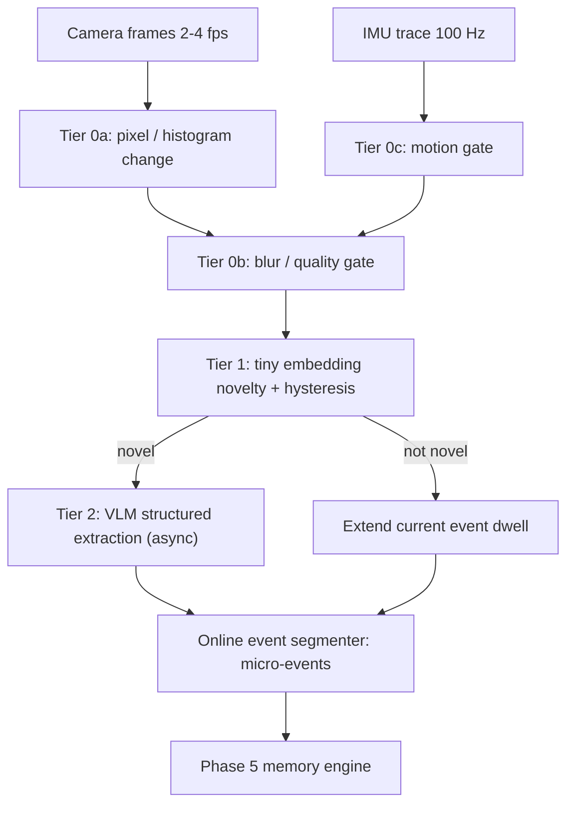

# Phase 4 — Keyframe Intelligence: Online, Budget-Constrained Event Segmentation

> Research problem **P1** in `docs/plans/00-roadmap.md`.
> Rules: Mobile Emulation Profile (roadmap §4.1), three-layer testing (§5),
> pessimist rules (§5.1). Every step ends with `## You test this`.

## Goal
Replace "1 frame every 5 s" with an **online cascade** that decides, frame by
frame and with no look-ahead, whether a moment is worth the cost of the heavy
model — and prove with real egocentric recordings that it (a) calls the heavy
model far less, (b) misses fewer short events, and (c) produces fewer
duplicate memories than uniform sampling. Then prove it runs the same way on
both phones.

## Why this phase exists
- Phase 3's captioner runs at ~13 s/frame on laptop CPU (A4). Uniform sampling
  at 5 s cannot keep up live even on the laptop; on the phone it is worse.
- Uniform sampling misses sub-5 s actions (put keys down, pick passport up)
  and floods static scenes (3 h at a desk = 2,160 near-identical captions).
- This is where the project stops being integration work: no library decides
  *when* an egocentric moment matters under a milliwatt budget.

## Architecture (target)

Every tier logs its decision + reason + cost per frame into a **decision log**
(`data/runs/<run_id>/decisions.jsonl`) so any keyframe — or any miss — can be
explained after the fact.

## Steps

| # | Step | Type | Key output |
|---|---|---|---|
| 01 | Egocentric evaluation dataset v1 | Research + you record | ≥ 3 h annotated video, ≥ 150 QA, event boundaries |
| 02 | Mobile emulation profile + parity harness | Infra | CPU/RAM/thread caps, wall-clock replay, golden fixtures |
| 03 | Phone sensor-capture spike (video + IMU) | Phone, early | Synced video + IMU recordings from the real phone |
| 04 | Baseline B0: uniform sampling, honestly measured | Experiment | Baseline numbers every later tier must beat |
| 05 | Tier 0a: pixel / histogram change gate | Implement + experiment | Drop rate vs. missed events curve |
| 06 | Tier 0b: blur & quality gate | Implement + experiment | Calibrated thresholds per lighting |
| 07 | Tier 0c: IMU motion gate | Implement + experiment | IMU on/off ablation |
| 08 | Tier 1: embedding novelty gate + adaptive hysteresis | Research + implement | Model choice, threshold curves |
| 09 | Tier 2: structured VLM extraction (provisional → refined) | Implement + experiment | JSON slots vs free caption |
| 10 | Online event segmenter (micro-events) | Implement + experiment | Boundary F1 vs annotations |
| 11 | Ablation study (B0–B6) | Experiment | The main P1 results table |
| 12 | Held-out real-world gauntlet | You-in-the-loop | Results on videos never used for tuning |
| 13 | Mobile parity gate 4 | Phone | Same decisions on Pixel + Infinix, measured cost |

## Exit criteria (phase is done only if all hold)
- Cascade beats B0 on **both** heavy-model calls/hour and short-event recall
  on the held-out set (Step 12), not only the tuning set.
- Boundary F1 ≥ 0.55 (minimum) on held-out set.
- Decision agreement Python ↔ Kotlin on golden fixtures ≥ 95 % (Step 13).
- Measured per-tier latency and power on both phones are in the results file.
- You approved the keyframe review sessions (Steps 05–12).

## Risks (pessimistic)
| Risk | Likelihood | Mitigation |
|---|---|---|
| Thresholds overfit to our own few videos | High | Held-out set recorded *after* tuning (Step 12); report both |
| Laptop OpenCV ≠ Android implementation (rounding, colour space, resize) | High | Golden fixtures + tolerance tests (Step 02, 13) |
| CameraX delivers YUV at different resolution than our test videos | Medium | Step 03 records with the same pipeline the app will use |
| Tier 1 model not available as `.tflite` / LiteRT | Medium | Step 08 shortlists only models with a verified mobile artifact |
| Async VLM backlog grows unbounded on phone | High | Bounded queue + drop-oldest policy + backlog metric (Step 09) |
| We beat B0 only because B0 is a strawman | Medium | B0 also tested at 1 s / 2 s / 3 s, plus a "smart" uniform + dedup baseline (current Phase 3 behaviour) |
