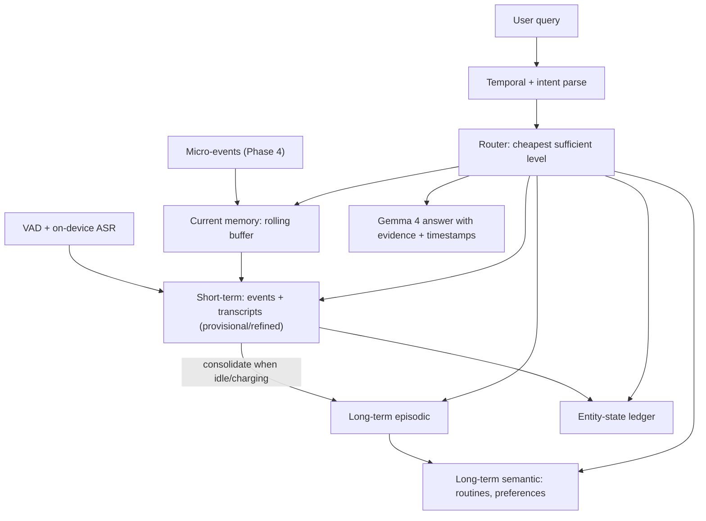

# Phase 5 — Hierarchical Memory & Temporal State Reconciliation

> Research problem **P2** (`docs/plans/00-roadmap.md`). Step docs in this
> folder are written at plan level now; each gets a "Kickoff refinement" note
> appended when the phase starts, using Phase 4 results. Nothing is deleted.

## Goal
Turn micro-events (Phase 4) and speech (this phase) into a memory that:
1. is **hierarchical** — current → short-term → long-term episodic + semantic
   (LightMem-Ego's structure, which we cite as the reference design);
2. stays **consistent when the world changes** — an entity-state ledger with
   explicit invalidation, so "where are my keys *now*?" never returns the 9 AM
   location (the gap LightMem-Ego names in its own limitations);
3. answers **temporal** questions ("after the pharmacy, before lunch") with
   time-window gating instead of hoping embeddings understand time;
4. has a **lifecycle policy** — merge, forget, promote — with bounded storage;
5. runs fully on-device, verified on both phones.

## Architecture (target)

## Steps

| # | Step | Type |
|---|---|---|
| 01 | Memory schema v2 + non-destructive migration | Design + implement |
| 02 | Current memory (working buffer) | Implement |
| 03 | Short-term event store + async refine/backfill | Implement |
| 04 | On-device audio: VAD + ASR aligned to timeline | Implement + phone spike |
| 05 | Long-term episodic consolidation | Research + implement |
| 06 | Semantic memory (routines/preferences) — exploratory | Research |
| 07 | Entity-state ledger & invalidation (P2 core) | Research + implement |
| 08 | Temporal query understanding + time-window gating | Implement + experiment |
| 09 | Query router | Implement + experiment |
| 10 | Lifecycle policy: merge / forget / promote + storage stress | Research + experiment |
| 11 | Retrieval & QA evaluation v2 (main P2 results) | Experiment |
| 12 | Mobile parity gate 5 | Phone |

## Exit criteria
- State-change query accuracy ≥ 70 % (min) on held-out scenarios, and clearly
  above flat RAG (Phase 1 pipeline) on the same queries.
- Temporal-order accuracy reported per category with CIs.
- Human-judged QA accuracy ≥ 50 % (min) fully offline.
- Storage growth per captured hour measured; 7-day replay stays within budget.
- Memory engine runs on both phones with documented latency P50/P90.

## Risks (pessimistic)
| Risk | Mitigation |
|---|---|
| Entity extraction from small VLM is noisy → ledger confidently wrong | Confidence per transition, ledger answers cite evidence frames, fallback to retrieval when confidence low |
| Consolidation summaries hallucinate | Summaries keep pointers to source events; QA can drill down; human audit of 30 summaries |
| Router misroutes → misses answers | Router failure analysis; "fan-out on low confidence" fallback |
| Schema migration loses Phase 1/2 memories | Migration is additive; backup before migrate; row counts verified (core.md: never destructive silently) |
| FTS4 vs FTS5 parity on Android | Decided in Step 01 (roadmap §8) |
